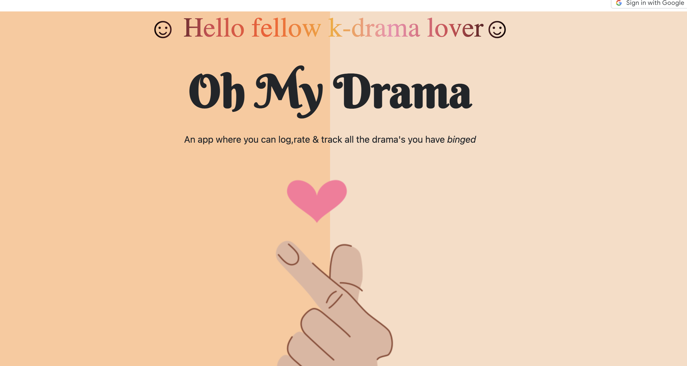

#  _OhMyDrama_  
# **[• Use OhMyDrama here](https://ohmydrama.fly.dev/)**

 A fun interactive way to keep track of drama series that you have watched - you are also able to see what your friends thought about them too!

My friend group is obsessed with watching k-dramas. We have a spreadsheet to track what we have watched so far and how we rated them. I decided to make a full *CRUD* app for it  

# Technologies Used

 - HTML5
 - CSS
 - JavaScript ES6
 - MongoDB
 - Mongoose
 - EJS
 - Node.js
 - Google OAuth
 - Google Chrome Developer Tools
 - VSCode
 - StackOverflow, MDN, W3C

## Next Steps 🧊 
 - [ ] Implement user Profiles Pages
 - [ ] Implement the ability to have friends lists
 - [ ] Use an API so users don't have to add cast members
 - [ ] List dramas from highest to lowest Average rating
 - [ ] Improve Responsive Design
 - [ ] Mobile Device Usability

## **[Click to view Planning Materials](https://trello.com/b/AqYa4sV4/ohmydrama-app)**

### Credits/Attribution:

<a href="https://www.flaticon.com/free-icons/korean" title="korean icons">Korean icons created by alien.studio - Flaticon</a>
<a href="https://www.flaticon.com/free-icons/cute" title="cute icons">Cute icons created by BomSymbols - Flaticon</a>
<a href="https://www.flaticon.com/free-icons/cute" title="cute icons">Cute icons created by Freepik - Flaticon</a>
<a href="https://www.flaticon.com/free-icons/cat" title="cat icons">Cat icons created by Freepik - Flaticon</a>
